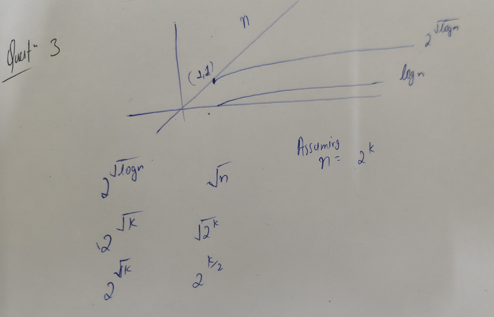

# Assignment 1

## Question 1

Ranking of functions (Slowest at top) :

1. $(log log(n))^{1.9}$
2. $(log(n))^{0.5}$
3. $8 log(n)$
4. $\sqrt{n}$
5. $2^{\log n}$
6. $log(n!)$
7. $n log(n)$
8. $n^{1.05}$
9. $n^{1.9}$
10. $n^{3}$
11. $3^n$
12. $n!$

## Question 2

### A

Assumptions: n is a power of 2 .

```cpp
float Arbitary_task (Arr){
    n = Arr. size;
    if (n-1 == 0){
        return Arr [0];
    }

    //let Arr1,Arr2 be arrays of size n/2
    for (i=0; i <= (n/2)-1; i++){
        Arr1[i] =Arr[i]*2;
        Arr2[i]=(Arr[n/2+i])*0.5;
    }
    for (i=0; i <= (n/2)-1; i++){
        for (j=i+1; j <= (n/2)-1; j++){
            if (Arr1[i] == 0.5*Arr2[j])
                Arr2[j] = 10;
        }
    }
    temp1=Arbitary_task(Arr1);
    temp2=Arbitary_task(Arr2);
    return min(temp1,temp2);
}
```

>For n = 1 , this algorithm is of time complexity O(1).

- For $n\to\infty$ this algorithm will be O($n^2$) as the second `for` loop gets the time complexity approximately O($n^2$)

### B

As time complexity is $O(n^2)$ ,
time taken for 128 units, t = $5*((128)^2 / (32)^2)$

- t = 5*16 = 80 seconds => 1 minute 20 seconds

## Question 3

As we can assume n to be a large number , thus

$n > \sqrt{n} > log(n)$

$log(n) > \sqrt{log(n)} > log(log(n))$

$2^{log(n)}>2^{\sqrt {\log(n)}} > 2^{\log(\log(n))}$

> $n > 2^{\sqrt{\log(n)}} > log(n)$

| Function          | True/False |
| ----------------- | ---------- |
| $O(n)$            | True       |
| $O(n^{1.9})$      | True       |
| $O(log(n))$       | False      |
| $o(n)$            | True       |
| $o(\log(n))$      | False      |
| $\Omega$(n)       | False      |
| $\Omega$(1)       | True       |
| $\Omega$(log(n))  | True       |
| $\omega(n^{0.5})$ | False      |
| $\omega$(1)       | True       |
| $\Theta$(n)       | False      |
| $\Theta(n^{1.9})$ | False      |
| $\Theta$(log(n))  | False      |



## Question 4

### (a) $log(n!) = \Theta(nlog(n))$

> $log(n!) = log(n* (n-1) * (n-2) *. . . * 2 * 1) =$ $\sum_{i=1}^{n} log(i)$

- $log(n) + log(n-1) + . . . + log(2) + log(1) <=$ $log(n) + log(n) . . . log(n)$  {n times}

- $log(n!)$ <= $nlog(n)$

>$log(n!) = O(nlog(n)) \qquad -1$

$log(n!) >= log(\frac{n}2) + . . . +log(n) >= \frac{n}{2} log(\frac{n}{2})$

> $log(n!) = \Omega(nlog(n)) \qquad -2$  

**By 1 & 2 , $log(n!) = \Theta(nlog(n))$**

### (b) $n! = \omega(2^{n})$

$n! = n*(n-1) . . * 2* 1  >= 2*2 . . *2*2 \quad (n\quad times)$

> $n! = \omega(2^n)$

### (c) $n! = O(n^n)$

$n! = n*(n-1) . . * 2* 1  <= n*n . . *n*n \quad (n\quad times)$

> $n! = O(n^n)$

### (d) $\sum_{i = 0}^{n} i^2  = \Theta(n^3)$

$f(n) = \sum_{i = 0}^{n} i^2 =  \frac{n(n+1)(2n+1)}{6} = \frac{2n^3+ 3n^2 +3n +1}{6}$

- For $n_0 = 1 , g(n) = n^3$
  - $c = 3/2 , f(n) <= cg(n)$
  - $c = 1/6 , f(n) >= cg(n)$

> $f(n) = \Theta(n^3)$

### (e) $n^{1.001} + nlog(n) = Θ(n^{1.001})$

For much larger $n$ like $n>2^{14,000}$ , $n^{1/1000} >>log(n)$

- $n*n^{1/1000} >> n*log(n)$

> $\implies n^{1.001} + nlog(n) \approx n^{1.001}$

Thus , $n^{1.001} + nlog(n) = Θ(n^{1.001})$

## Question 5

### (a)

```cpp
sum = 0;
for ( int i =1; i<= n; i++)
    sum += rand () + i ;
```

The for loop runs n times running a constant time function (`sum += rand() + i`)

$\therefore$ Time Complexity is $O(n)$ .

### (b)

```cpp
sum = 0;
for (int i=1; i<= n; i++)
    for (int j=i ; j<= n; j++)
        sum += i + j ;
```

The for loop runs $\frac{n(n+1)}{2}$ times running a constant time function (`sum += i + j ;`)

$\therefore$ Time Complexity is $O(n^2)$ .

### (c)

```cpp
sum = 0;
i = n;
while ( i > 0) {
    sum += i ;
    i /= 2; }
```

 The loop runs for $log_2 n$ times for a constant time function (`sum += i ;`)

 $\therefore$ Time Complexity is $O(log(n))$

### (d)

 ```cpp
 sum = 0;
for (int i=1; i<= n; i++)
    sum += rand ( );
for (int j=1; j<= m; j++)
    sum += rand ( );
```

$1^{st}$ loop runs for $n$ times for a constant function,$2^{nd}$  loop runs for $m$ times for a constant function.

$\therefore$ Time Complexity is $O(n+m)$

## Question 6

### (a) $p(n) = 2 n^{1.5} + 10, q(n) = 200 n^2 + 100$

For much larger $n$ , $n^2 > n^{1.5}$

>$\therefore$ $q(n)$ is asymptotically bigger than $p(n)$.

### (b) $p(n) = 30 n^2 2^n, q(n) = 60 n 2^n + 30 n$

Looking at the terms with higest powers in both functions , for $n\to \infin : 30n^2 2^n \gg 60n 2^n$
> $\implies$ $p(n)$ is asymptotically bigger than $q(n)$.

### (C) $p(n) = n, q(n) = n^{(1+cos(n))}$

As $n\to\infin\quad,cos(n)$ oscillates between $[-1,1]$

- $q(n)$ varies between $[1,n^2]$ which makes it difficult to make any bold statement about comparison between both function.

 >$\therefore$ We can't make a definitve statement over all $n$ due to varying exponent.

## Question 7

| Functions                    | $O$         | $\Omega$    | $\Theta$    | $o$       | $\omega$ |
| ---------------------------- | ----------- | ----------- | ----------- | --------- | -------- |
| (a) $15 n^{1.5} + 25 n − 35$ | $n^{1.5}$   | $n^{1.5}$   | $n^{1.5}$   | $n^2$     | $n$      |
| (b) $30 n^2log(n) + 40 n$    | $n^2log(n)$ | $n^2log(n)$ | $n^2log(n)$ | $n^3$     | $n^2$    |
| (c) $22 n^3 + 35 n^2log(n)$  | $n^3$       | $n^3$       | $n^3$       | $n^4$     | $n^2$    |
| (d) $100 n 2^n − 120 n^3$    | $n2^n$      | $n2^n$      | $n2^n$      | $n^2 2^n$ | $2^n$    |

## Question 8

- A function $f(n)$ is in $\Omega(g(n))$ if there exist positive constants $c > 0$ and $n_0 > 0$ such that:$$f(n) \ge c \cdot g(n) \ge 0 \quad \text{for all } n \ge n_0$$

- A function $f(n)$ is in $O(g(n))$ if there exist positive constants $c > 0$ and $n_0 > 0$ such that:$$0 \le f(n) \le c \cdot g(n) \quad \text{for all } n \ge n_0$$

### (a) $25 n^3log(n) + 7 n^2 \ne O(n^3)$

#### By defintion

Assume for the sake of contradiction that $25n^3 \log n + 7n^2 = O(n^3)$ .By the definition, there must exist some positive constants $c > 0$ and $n_0 > 0$ such that for all $n \ge n_0$ :

$$25n^3 \log n + 7n^2 \le c \cdot n^3$$
$$\frac{25n^3 \log n + 7n^2}{n^3} \le \frac{c \cdot n^3}{n^3}$$
$$25 \log n + \frac{7}{n} \le c$$

Since the left side grows to infinity (as $n$ grows larger), it is impossible to find a finite constant $c$ that bounds it from above for all $n \ge n_0$. Our initial assumption is false.

>Therefore, by definition:$$25n^3 \log n + 7n^2 \neq O(n^3)$$

#### By observation

 As the dominant term in this function is $25 n^3log(n)$, and it's Time Complexity is $\Theta(n^3log(n))$ , Also it is always $> n^3$ ,
> $\therefore$ The function is $\omega(n^3)$ and thus $\ne O(n^3)$

### (b) $14 n^3 + 9 n^2\ne O(n^2)$

 As the dominant term in this function is $14n^3$ which is always larger than $n^2$
 > $\therefore$ The function $\ne O(n^2)$

### (c) $18 n^3log(n) + 6 n^2 \ne Ω(n^4)$

#### By defintion

Assume for the sake of contradiction that $18n^3 \log n + 6n^2 = \Omega(n^4)$.
By the definition, there must exist positive constants $c > 0$ and $n_0 > 0$ such that for all $n \ge n_0$:
$$18n^3 \log n + 6n^2 \ge c \cdot n^4$$
$$\frac{18n^3 \log n + 6n^2}{n^4} \ge \frac{c \cdot n^4}{n^4}$$
$$\frac{18 \log n}{n} + \frac{6}{n^2} \ge c$$
Since both terms on the left side approach $0$ as $n$ approaches infinity, the entire left side of the inequality approaches $0$.
However, our definition requires $c$ to be a positive number greater than zero.

Therefore, for any chosen $c > 0$, you can always find an $n$ large enough where the inequality $\frac{18 \log n}{n} + \frac{6}{n^2} \ge c$ fails.

>Therefore, by definition:$$18n^3 \log n + 6n^2 \neq \Omega(n^4)$$

#### By observation

As the dominant term in this function is $n^3 log(n)$ , $$and \quad n > log(n) \quad \forall \quad n$$

$\therefore n^4 > n^3log(n)$ ,

>$\implies f(n) = o(n^4)\quad and \neq \Omega(n^4)$

### (e) $\frac{n^2}{\log (n)} \ne \Theta(n^2)$

For $f(n) = \Theta(g(n))$ to be true, it must be true that:

1. $f(n) = O(g(n))$
2. $f(n) = \Omega(g(n))$

Starting with using definition of $\Omega$
