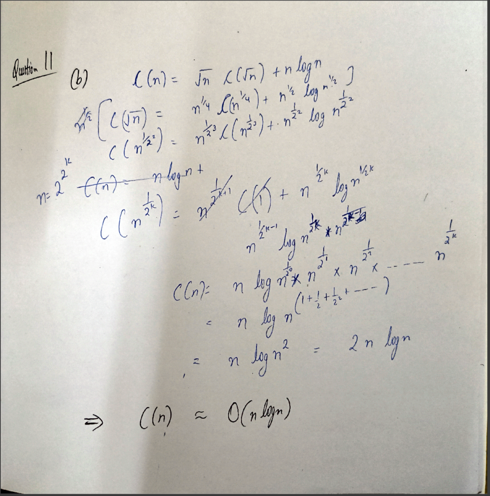

# Assignment 1

## Question 1

Ranking of functions (Slowest at top) :

1. $(log log(n))^{1.9}$
2. $(log(n))^{0.5}$
3. $8 log(n)$
4. $\sqrt{n}$
5. $2^{\log n}$
6. $log(n!)$
7. $n log(n)$
8. $n^{1.05}$
9. $n^{1.9}$
10. $n^{3}$
11. $3^n$
12. $n!$

## Question 2

### A

Assumptions: n is a power of 2 .

```cpp
float Arbitary_task (Arr){
    n = Arr. size;
    if (n-1 == 0){
        return Arr [0];
    }

    //let Arr1,Arr2 be arrays of size n/2
    for (i=0; i <= (n/2)-1; i++){
        Arr1[i] =Arr[i]*2;
        Arr2[i]=(Arr[n/2+i])*0.5;
    }
    for (i=0; i <= (n/2)-1; i++){
        for (j=i+1; j <= (n/2)-1; j++){
            if (Arr1[i] == 0.5*Arr2[j])
                Arr2[j] = 10;
        }
    }
    temp1=Arbitary_task(Arr1);
    temp2=Arbitary_task(Arr2);
    return min(temp1,temp2);
}
```

>For n = 1 , this algorithm is of time complexity O(1).

- For $n\to\infty$ this algorithm will be O($n^2$) as the second `for` loop gets the time complexity approximately O($n^2$)

### B

As time complexity is $O(n^2)$ ,
time taken for 128 units, t = $5*((128)^2 / (32)^2)$

- t = 5*16 = 80 seconds => 1 minute 20 seconds

## Question 3

As we can assume n to be a large number , thus

$n > \sqrt{n} > log(n)$

$log(n) > \sqrt{log(n)} > log(log(n))$

$2^{log(n)}>2^{\sqrt {\log(n)}} > 2^{\log(\log(n))}$

> $n > 2^{\sqrt{\log(n)}} > log(n)$

| Function          | True/False |
| ----------------- | ---------- |
| $O(n)$            | True       |
| $O(n^{1.9})$      | True       |
| $O(log(n))$       | False      |
| $o(n)$            | True       |
| $o(\log(n))$      | False      |
| $\Omega$(n)       | False      |
| $\Omega$(1)       | True       |
| $\Omega$(log(n))  | True       |
| $\omega(n^{0.5})$ | False      |
| $\omega$(1)       | True       |
| $\Theta$(n)       | False      |
| $\Theta(n^{1.9})$ | False      |
| $\Theta$(log(n))  | False      |


## Question 4

### (a) $log(n!) = \Theta(nlog(n))$

> $log(n!) = log(n* (n-1) * (n-2) *. . . * 2 * 1) =$ $\sum_{i=1}^{n} log(i)$

- $log(n) + log(n-1) + . . . + log(2) + log(1) <=$ $log(n) + log(n) . . . log(n)$  {n times}

- $log(n!)$ <= $nlog(n)$

>$log(n!) = O(nlog(n)) \qquad -1$

$log(n!) >= log(\frac{n}2) + . . . +log(n) >= \frac{n}{2} log(\frac{n}{2})$

> $log(n!) = \Omega(nlog(n)) \qquad -2$  

**By 1 & 2 , $log(n!) = \Theta(nlog(n))$**

### (b) $n! = \omega(2^{n})$

$n! = n*(n-1) . . * 2* 1  >= 2*2 . . *2*2 \quad (n\quad times)$

> $n! = \omega(2^n)$

### (c) $n! = O(n^n)$

$n! = n*(n-1) . . * 2* 1  <= n*n . . *n*n \quad (n\quad times)$

> $n! = O(n^n)$

### (d) $\sum_{i = 0}^{n} i^2  = \Theta(n^3)$

$f(n) = \sum_{i = 0}^{n} i^2 =  \frac{n(n+1)(2n+1)}{6} = \frac{2n^3+ 3n^2 +3n +1}{6}$

- For $n_0 = 1 , g(n) = n^3$
  - $c = 3/2 , f(n) <= cg(n)$
  - $c = 1/6 , f(n) >= cg(n)$

> $f(n) = \Theta(n^3)$

### (e) $n^{1.001} + nlog(n) = Θ(n^{1.001})$

For much larger $n$ like $n>2^{14,000}$ , $n^{1/1000} >>log(n)$

- $n*n^{1/1000} >> n*log(n)$

> $\implies n^{1.001} + nlog(n) \approx n^{1.001}$

Thus , $n^{1.001} + nlog(n) = Θ(n^{1.001})$

## Question 5

### (a)

```cpp
sum = 0;
for ( int i =1; i<= n; i++)
    sum += rand () + i ;
```

The for loop runs n times running a constant time function (`sum += rand() + i`)

$\therefore$ Time Complexity is $O(n)$ .

### (b)

```cpp
sum = 0;
for (int i=1; i<= n; i++)
    for (int j=i ; j<= n; j++)
        sum += i + j ;
```

The for loop runs $\frac{n(n+1)}{2}$ times running a constant time function (`sum += i + j ;`)

$\therefore$ Time Complexity is $O(n^2)$ .

### (c)

```cpp
sum = 0;
i = n;
while ( i > 0) {
    sum += i ;
    i /= 2; }
```

 The loop runs for $log_2 n$ times for a constant time function (`sum += i ;`)

 $\therefore$ Time Complexity is $O(log(n))$

### (d)

 ```cpp
 sum = 0;
for (int i=1; i<= n; i++)
    sum += rand ( );
for (int j=1; j<= m; j++)
    sum += rand ( );
```

$1^{st}$ loop runs for $n$ times for a constant function,$2^{nd}$  loop runs for $m$ times for a constant function.

$\therefore$ Time Complexity is $O(n+m)$

## Question 6

### (a) $p(n) = 2 n^{1.5} + 10, q(n) = 200 n^2 + 100$

For much larger $n$ , $n^2 > n^{1.5}$

>$\therefore$ $q(n)$ is asymptotically bigger than $p(n)$.

### (b) $p(n) = 30 n^2 2^n, q(n) = 60 n 2^n + 30 n$

Looking at the terms with higest powers in both functions , for $n\to \infin : 30n^2 2^n \gg 60n 2^n$
> $\implies$ $p(n)$ is asymptotically bigger than $q(n)$.

### (C) $p(n) = n, q(n) = n^{(1+cos(n))}$

As $n\to\infin\quad,cos(n)$ oscillates between $[-1,1]$

- $q(n)$ varies between $[1,n^2]$ which makes it difficult to make any bold statement about comparison between both function.

 >$\therefore$ We can't make a definitve statement over all $n$ due to varying exponent.

## Question 7

| Functions                    | $O$         | $\Omega$    | $\Theta$    | $o$       | $\omega$ |
| ---------------------------- | ----------- | ----------- | ----------- | --------- | -------- |
| (a) $15 n^{1.5} + 25 n − 35$ | $n^{1.5}$   | $n^{1.5}$   | $n^{1.5}$   | $n^2$     | $n$      |
| (b) $30 n^2log(n) + 40 n$    | $n^2log(n)$ | $n^2log(n)$ | $n^2log(n)$ | $n^3$     | $n^2$    |
| (c) $22 n^3 + 35 n^2log(n)$  | $n^3$       | $n^3$       | $n^3$       | $n^4$     | $n^2$    |
| (d) $100 n 2^n − 120 n^3$    | $n2^n$      | $n2^n$      | $n2^n$      | $n^2 2^n$ | $2^n$    |

## Question 8

- A function $f(n)$ is in $\Omega(g(n))$ if there exist positive constants $c > 0$ and $n_0 > 0$ such that:$$f(n) \ge c \cdot g(n) \ge 0 \quad \text{for all } n \ge n_0$$

- A function $f(n)$ is in $O(g(n))$ if there exist positive constants $c > 0$ and $n_0 > 0$ such that:$$0 \le f(n) \le c \cdot g(n) \quad \text{for all } n \ge n_0$$

### (a) $25 n^3log(n) + 7 n^2 \ne O(n^3)$

#### By defintion

Assume for the sake of contradiction that $25n^3 \log n + 7n^2 = O(n^3)$ .By the definition, there must exist some positive constants $c > 0$ and $n_0 > 0$ such that for all $n \ge n_0$ :

$$25n^3 \log n + 7n^2 \le c \cdot n^3$$
$$\frac{25n^3 \log n + 7n^2}{n^3} \le \frac{c \cdot n^3}{n^3}$$
$$25 \log n + \frac{7}{n} \le c$$

Since the left side grows to infinity (as $n$ grows larger), it is impossible to find a finite constant $c$ that bounds it from above for all $n \ge n_0$. Our initial assumption is false.

>Therefore, by definition:$$25n^3 \log n + 7n^2 \neq O(n^3)$$

#### By observation

 As the dominant term in this function is $25 n^3log(n)$, and it's Time Complexity is $\Theta(n^3log(n))$ , Also it is always $> n^3$ ,
> $\therefore$ The function is $\omega(n^3)$ and thus $\ne O(n^3)$

### (b) $14 n^3 + 9 n^2\ne O(n^2)$

 As the dominant term in this function is $14n^3$ which is always larger than $n^2$
 > $\therefore$ The function $\ne O(n^2)$

### (c) $18 n^3log(n) + 6 n^2 \ne Ω(n^4)$

#### By defintion

Assume for the sake of contradiction that $18n^3 \log n + 6n^2 = \Omega(n^4)$.
By the definition, there must exist positive constants $c > 0$ and $n_0 > 0$ such that for all $n \ge n_0$:
$$18n^3 \log n + 6n^2 \ge c \cdot n^4$$
$$\frac{18n^3 \log n + 6n^2}{n^4} \ge \frac{c \cdot n^4}{n^4}$$
$$\frac{18 \log n}{n} + \frac{6}{n^2} \ge c$$
Since both terms on the left side approach $0$ as $n$ approaches infinity, the entire left side of the inequality approaches $0$.
However, our definition requires $c$ to be a positive number greater than zero.

Therefore, for any chosen $c > 0$, you can always find an $n$ large enough where the inequality $\frac{18 \log n}{n} + \frac{6}{n^2} \ge c$ fails.

>Therefore, by definition:$$18n^3 \log n + 6n^2 \neq \Omega(n^4)$$

#### By observation

As the dominant term in this function is $n^3 log(n)$ , $$and \quad n > log(n) \quad \forall \quad n$$

$\therefore n^4 > n^3log(n)$ ,

>$\implies f(n) = o(n^4)\quad and \neq \Omega(n^4)$

### (e) $\frac{n^2}{\log (n)} \ne \Theta(n^2)$

For $f(n) = \Theta(g(n))$ to be true, it must be true that:

1. $f(n) = O(g(n))$
2. $f(n) = \Omega(g(n))$

Starting with using definition of $\Omega$ , Assuming for sake of contradiction:
By the definition, there must exist positive constants $c > 0$ and $n_0 > 0$ such that for all $n \ge n_0$:
$$\frac{n^2}{\log n} \ge c \cdot n^2$$
$$\frac{1}{\log n} \ge c$$

- $c$ is fixed ,strictly positive constant .

Since the left side shrinks towards zero, it will eventually become strictly less than our positive constant $c$.
Therefore:
$$\frac{n^2}{\log n} \neq \Omega(n^2)$$
Since $f(n)$ is not in $\Omega(n^2)$, it cannot be tightly bounded by $n^2$. Consequently, by definition:
$$\frac{n^2}{\log n} \neq \Theta(n^2)$$

## Question 9

### $A(n) = 2A(\sqrt n) + \log^2(n)$

#### Inductive Hypothesis

Assume that the bound holds for all values up to some $k$ (where $k < n$). Specifically, we assume that for a sufficiently large $n$:

$$A(\sqrt{n}) \le c(\log^2 \sqrt{n})$$
$$A(\sqrt{n}) \le \frac{c}{4} (\log n)^2$$

#### Induction

Now substituting the  hypothesis back into the original  relation:
$$A(n) = 2A(\sqrt n) + \log^2(n)$$
Substituting the bound for $A(\sqrt{n})$:
$$A(n) \le 2 \left( \frac{c}{4} (\log n)^2 \right) + (\log^2 n)$$
$$A(n) \le \frac{c}{2} (\log n)^2 + 1 \cdot (\log^2 n)$$
$$A(n) \le \left( \frac{c}{2} + 1 \right) (\log^2 n)$$

To ensure $A(n) \le c \cdot \log^2 (n)$ , we need:
$$\left(\frac c2 + 1\right) \le c$$
$$\implies 2 \le c$$

With the choice of $c ≥ 2$ and $n_0 = 1$,  $A(n) ≤c · \log^2(n)$ for all $n ≥ n_0$, which means $A(n) = O(log^2(n))$.

## Quesiton 10

$E[X] =\frac1p$

### (a)

$P(n) = \frac1p\cdot(n\log n(n + \log n))$

### (b)

For any fixed $p$ , Time Complexity of $P(n) = O(\frac1p n^2 \log n)$

As $p$ approaches $0 ,  \quad \frac1p \to \infty$
>$\therefore$ Overall time complexity becomes undefined due to inverse proportionality of $p$ .

### (c)
$p$ is given to be probability, thus it's value lies between $[0,1]$ , as the value of $p$ increases from $0$ to $1$ which makes the Time Complexity decrease form  $\infty$ to it's minimum value $O(n^2\log n)$. 
So ,there is not any threshold value of $p$ that makes the algorithm run in polynomial time.The minimum it can do is make the algorithm run in polynomial-logarithmic time  .


## Question 11 

### (a) Recurrence relation

$C(n) = \lceil \sqrt n$ 
$\rceil \cdot C \left(\left \lfloor  \frac{n}{\lceil \sqrt {n} \rceil}  \right \rfloor \right) +n\log n$

### (b) 

For easier analysis , assuming 
$\left \lfloor  \frac{n}{\lceil \sqrt n \rceil}  \right \rfloor and \quad \lceil \sqrt n$ 
$\rceil = \sqrt n \implies C(n) \approx \sqrt n C(\sqrt {n}) +n\log n$


### (c)

The use of floor and ceiling function only makes the problem more complex. If n is perfectly divisible by $\sqrt n$ , the reccurence would be slightly simpler. This removes the minor discrepancies (like boundary conditions), but the overall time complexity is ineffected by these  minor flaws .

## Question 12 

### (a) 

1. The algorithm takes $O(\log n)$ time as it performs binary search on middle column
2. Then dividing the give matrix into two submatrices leads to addition of $2M(\frac n2)$ time .
3. At last merging the matrices takes constant time $O(1)$ .

>$\therefore$ Time Complexity $M(n) = 2M(\frac n2) + O(\log n) + O(1)$

### (b)

We can write every $M(k)$ term by expanding it 

$\implies M(n) = O(\log n) + O(\log \frac n2) +O(\log \frac n4)+ ...+O(\log 1) \approx (\log n )\cdot O(\log n) = O((\log n)^2)$

### (c) 

The use of ceiling and floor function only complicates the process but has no effect on time complexity . These functions ensures the sub division of matirces properly as when n is not divisible by 2 these function handles that situation.

Potential inefficiencies compared to one dimensional binary search arises due to the division process of matrix in which binary search is applied to every new matrix formed which increases the time complexity from $O(\log n)$ to $O(log^2n)$.
This 2D nature of requires more comparisons and recursions , and hence increases the time complexity. 

It is possible to make algorithm efficient by assuming the matrix as a single array and make Time Complexity as binary search in 1 Dimension.

## Quesstion 13

### $T(n) = a n^klog^kn + b n^{k−1}log^{k−1}n + c n^k + d n^{k−1} +e/log(n)$

#### (a)
Given $k \ge 1$ , by observation the dominant term as $n \to \infty$ is $an^klog^kn$.


#### (b)
From (a) dominant term is $an^klog^kn$ 
1. $T(n) \ne O(n^{k−1})$
    
    True

    as $n^klog^kn \gg n^{k-1}$ there will be no constant $c$ such that  
    $$\forall n \ge n_0 , \quad n^klog^kn \le cn^{k-1}$$
>$\therefore$ $T(n) \ne O(n^{k−1})$

2. $T(n) \ne O(n^k)$
   
    True

    as $n^klog^kn \gg n^{k}$ there will be no constant $c$ such that  
    $$\forall n \ge n_0 , \quad n^klog^kn \le  cn^{k}$$
>$\therefore$ $T(n) \ne O(n^k)$

3. $T(n) \ne Ω(n^{k+1})$

    True
   
   Since $k$ is finite constant  , no matter how large it is $\quad \log^k n \ll n ,\quad as \quad n \to \infty$ 
   
   $\implies$ there is no constant $c$ such that 
   $$\forall n\ge n_0 , \quad n^klog^kn \ge cn^{k+1}$$
>$\therefore$ $T(n) \ne Ω(n^{k+1})$

4. $T(n) \ne Ω(n^klog(n))$

    False

    Since $k$ is finite constant  $\ge 1 \quad \log n \ll \log^k n ,\quad as \quad n \to \infty$ 
   
   $\implies$ there exists constant $c$ such that 
   $$\forall n\ge n_0 , \quad n^klog^kn \ge cn^{k}\log n$$
>$\therefore$ $T(n) = Ω(n^{k}\log n)$
   
5. $\lim_{n\to \infty} \frac{a n^klog^kn + b n^{k−1}log^{k−1}n + c n^k + d n^{k−1} +e/log(n)}{n^k}$

    As $n\to\infty$ the limit becomes $a\log^k n+c$ which is non zero and $\to\infty .$ 

    In terms of asymptotic notation, this means:
    - $T(n) = \omega(n^k)$ (Strict lower bound)
    - $T(n) = \Omega(n^k)$ (Lower bound)
    - $T(n) \neq O(n^k)$ (It is not bounded from above by $n^k$)

    The limit approaching infinity implies that $\Theta(n^k)$ is NOT a tight bound for $T(n)$.
    As $T(n)$ outgrows $n^k$  

#### (c)

For $k = 3$ , the function becomes 
$$T(n) = a n^3log^3n + b n^{2}log^{2}n + c n^3 + d n^{2} +elog(n)$$
The dominant term is $an^3log^3n$ ,

- It grows faster than $n^2$ 
  $$\therefore T(n) \ne O(n^2)$$
- It grows faster than $n^3$
  $$\therefore T(n) \ne O(n^3)$$
- It grows slower than $n^4$
  $$\therefore T(n) \ne \Omega(n^4)$$
- It grows faster than $n^3 \log n$
  $$\therefore T(n) = \Omega(n^3 \log n)$$

## Question 14 

### $f(n) = n^{n^{n^{n}}} , \quad g(n) = 2^{2^{n^{n}}}$

#### (a) $f(n) = O(g(n))$

False 

- A function $f(n)$ is in $O(g(n))$ if there exist positive constants $c > 0$ and $n_0 > 0$ such that:$$0 \le f(n) \le c \cdot g(n) \quad \text{for all } n \ge n_0$$

$$n = n$$
$$n^n = n^n$$
$$n^{n^{n}} > 2^{n^{n}}$$
$$Also, \quad n^{n^{n^{n}}} > 2^{2^{n^{n}}}$$

Since, there exists no $c$ which can make the deifinition true

#### (b) $f(n) = \Omega(g(n))$

True

- A function $f(n)$ is in $\Omega(g(n))$ if there exist positive constants $c > 0$ and $n_0 > 0$ such that:$$f(n) \ge c \cdot g(n) \ge 0 \quad \text{for all } n \ge n_0$$

$$\quad n^{n^{n^{n}}} > 2^{2^{n^{n}}}$$

Since , there exists $c > 0$ and $n \ge n_0$ which satisfies the definition ,

>$\implies f(n) = \Omega(g(n))$

## Question 15 

#### $O(n)$

- A function $f(n)$ is in $O(g(n))$ if there exist positive constants $c > 0$ and $n_0 > 0$ such that:
$$0 \le f(n) \le c \cdot g(n) \quad \text{for all } n \ge n_0$$

#### $\Omega(n)$

- A function $f(n)$ is in $\Omega(g(n))$ if there exist positive constants $c > 0$ and $n_0 > 0$ such that:
$$f(n) \ge c \cdot g(n) \ge 0 \quad \text{for all } n \ge n_0$$

#### $\Theta(n)$

- A function $f(n)$ is in $\Theta(g(n))$ if there exist positive constants $c_1 , c_2 > 0$ and $n_0 > 0$ such that:
$$c_1 \cdot g(n) \ge f(n) \ge c_2 \cdot g(n) \ge 0 \quad \forall n \ge n_0$$


### (a) $f(n) = O(g(n))$ and $g(n) = O(f(n))$ implies $f(n) = Θ(g(n)).$

$f(n) = O(g(n)) \implies 0 \le f(n) \le a \cdot g(n) \quad \text{for all } n \ge n_0 \quad -1$

$g(n) = O(f(n)) \implies f(n) \ge b \cdot g(n) \ge 0 \quad \text{for all } n \ge n_0 \quad -2$

From $\quad 1 \quad and \quad 2$ , we can conclude that 
$$a \cdot g(n) \ge f(n) \ge b \cdot g(n) \ge 0 \implies f(n) = \Theta(g(n))$$

>$\therefore$ The given statement is true

### (b) If $f(n) = O(g(n))$ and $g(n) = Ω(f(n))$, then $f(n) = Θ(g(n))$.

$f(n) = O(g(n)) \implies 0 \le f(n) \le a \cdot g(n) \quad \text{for all } n \ge n_0 \quad -1$

$g(n) = \Omega(f(n)) \implies g(n) \ge b \cdot f(n) \ge 0 \quad \text{for all } n \ge n_0 \quad -2$

By $\quad 1 \quad and \quad 2$ , we can not definitely say whether $f(n) = Θ(g(n))$ because both statements are mathematically equivalent.

We can disprove it by counter example like $f(n) = n , g(n) = n^2$

>$\therefore$ The given statement is false

### (c) If $f(n) = O(g(n))$ and $g(n) = Θ(f(n))$, then $f(n) = O(f(n)^2)$.

$f(n) = O(g(n)) \implies 0 \le f(n) \le a \cdot g(n) \quad \text{for all } n \ge n_0 \quad -1$

$g(n) = Θ(f(n)) \implies c_1 \cdot g(n) \ge f(n) \ge c_2 \cdot g(n) \ge 0 \quad \forall n \ge n_0 \quad -2$

$2^{nd}$ statement makes the $1^{st}$ reductant, as both function grow asypmtotically at same rate.

> But the statement   $f(n) = O(f(n)^2)$ is ,in general, False.


### (d) If $f(n) = O(g(n))$ and $g(n) = Ω(f(n))$, then $f(n) = Ω(f(n)log(g(n))).$

$f(n) = O(g(n)) \implies 0 \le f(n) \le a \cdot g(n) \quad \text{for all } n \ge n_0 \quad -1$

$g(n) = \Omega(f(n)) \implies g(n) \ge b \cdot f(n) \ge 0 \quad \text{for all } n \ge n_0 \quad -2$

By $\quad 1 \quad and \quad 2$ , we can say that $g(n)$ grows asymptotically faster than or same as $f(n)$.

$f(n) = Ω(f(n)log(g(n)))$ , this statement suggests that f(n) is lower bound by
$f(n) \cdot \log(g(n))$ but as $\log(g(n))$ increases the growth rate of $f(n)$ , $f(n) \cdot \log(g(n))$ would grow same or faster than $f(n)$ alone.

> The given statement is false .


